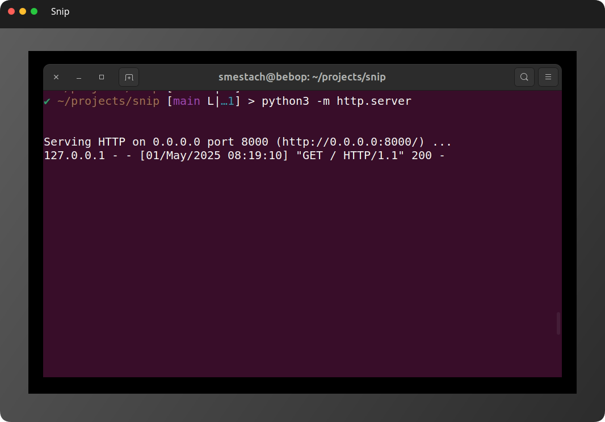

A browser based screenshot app, privacy focused (your data never leaves your browser, there's no backend).



# The pitch

  - sometimes there's no app installed for to make screenshots, but often you have access to a browser
  - a lot of screenshot app offer "sharing" or are directly storing the screenshots

# TODO

- try to auto detect black "padding" in screenshots
- allow user to annotate
- delayed screenshot

# Dev

```
python3 -m http.server
```

go to http://0.0.0.0:8000/


